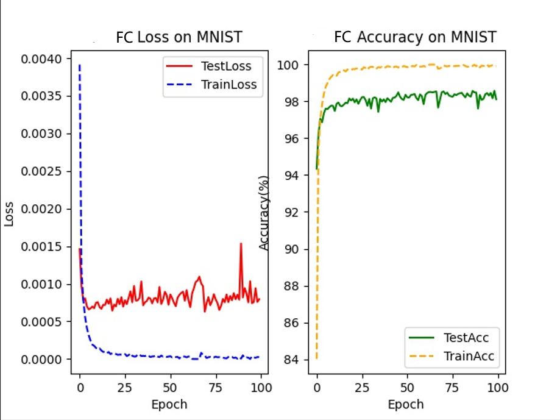
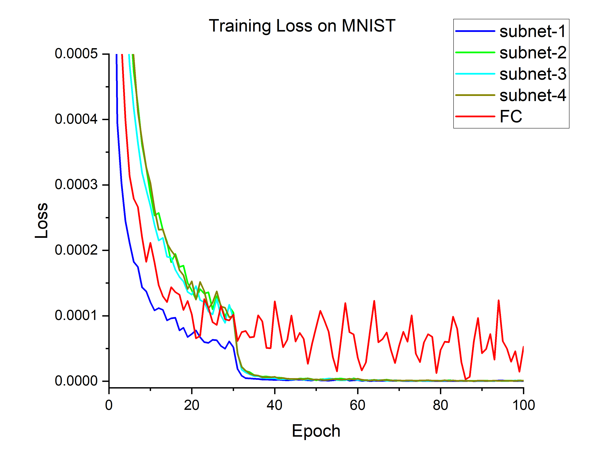

# Classification on MNIST & CIFAR-10 Dataset 

The code will automatically download MNIST and CIFAR-10 datasets

Training parameters

| Parameters               | values  |
| ------------------------ | ------ |
| `-b`,`--batch_size`      | `128`   |
| `--epochs`               | `100`   |
| `--lr`                   | `0.001`  |
| `--opt`                  | `SGD`  |
| `--momentum`             | `0.9`  |
| `--wd`, `--weight-decay` | `0` |
| `--device`               | `cpu` |


## MNIST Dataset

Image size: 28 x 28.  

Epoch: 100

Batch size: 256

Optimizer: Adam.

Learning rate: 0.001

Rank: 10.

| Networks         | Test accuracy | Model size | Training time|
| ---------------- | ------------- | --- | --- |
| FC-4L            | 98.64%        | 7.10 MB | 1,496s |
| FC-8L            |98.79%        | 16.54 MB | 1,553s |
| t-NN             |-        | 0.63 MB | - |
| Spectral-FC-8L-subnets-4 |  98.72%  | 1.06x4 MB| 1944s|
| Spectral-FC-8L-subnets-16 |  97.84%  | 0.07x16 MB| 3470s |
```shell
command :

python train.py --opt adam --model-name FC4Net
python train.py --model-name FC8Net --scheduler steplr --b 256 -j 8 --lr 0.001 --opt adam
python train.py --model-name FC8Net --scheduler steplr --b 256 --lr 0.001 --trans fft --l_idx 0 --r_idx 4 --split downsample --opt adam --filename spectral-fc8l-sub4 --device 0 --geo-p 0.9
```




## CIFAR 10 Dataset

Image size: 32 x 32 x 3.

### CNN:

Epoch: 300

Batch size: 256

lr: 0.01

### ResNet152x4
Image size : training 160 x 160; validating 128 x 128.

Epoch: 100

Batch size:512

lr: 0.003, multiply by 0.1 every 30 epochs

label smoothing 0.5

opt: SGD with momentum = 0.9

mixup: 0.1

pretrained on ImageNet-21K

| Network     | Test accuracy | Model size | Training time|
| ----------- |  ------------- | --- | --- |
|FC-8L| 61.27% | 252.52 MB | 3353s |
|spectral-FC-sub4| 68.17% | 15.88 MBx4|3999s|
|spectral-FC-sub16| 59.95% | 1.01 MBx16|6639s|
| ResNet152x4 | 99.21% | 3541.64 MB| 15.2h |
| spectral-ResNet152x4-subnets-4| 99.20 %| 3541.64 MBx4 | 17.3 h |
```shell
command :

python train.py --dataset cifar10 --model-name CNN8CIFAR10 --epochs 300 --opt adam
python train.py --dataset cifar10 --model-name CNN10CIFAR10 --epochs 300 --opt adam --trans dct --l_idx 0 --r_idx 4 --split downsample --pretrain ./CNN8CIFAR10.pth
```
## ImageNet Dataset
| Network     | Test accuracy | Model size | Training time|
| ----------- |  ------------- | --- | --- |
|AlexNet|63.44%*|224 MB| 40.8h |
|spectral-AlexNet|63.43%| 37.73 MBx4 | 20.2h |
|VGG-16|73.21%|527.79 MB| 81.2h |
|Spectral-VGG-16|72.82 %| 207.82 MBx4 | 44.14h |
|ResNet-34|76.1%|83.15 MB| 43.66h |
|spectral-ResNet34|74.13% | 83.15 MBx4 | 76.02h |
|ResNet-50|80.3% |97.69 MB| - |
|spectral-ResNet50 |77.84% | 97.69 MBx4 | - |


## ImageNet-21K
| Network     | Test accuracy | Model size | Training time|
| ----------- |  ------------- | --- | --- |
|ResNet-34| 40.45% | 122.35 MB | >246h  |
|spectral-ResNet-34| 30.40% | 122.35 MB | 90h |  |
