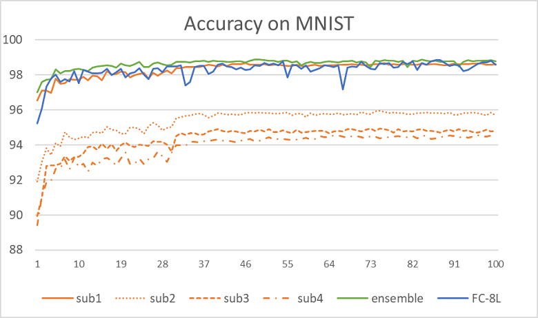

# Classification on MNIST & CIFAR-10 Dataset 

The code will automatically download MNIST and CIFAR-10 datasets.

The precision in parentheses is the result in the references.

## MNIST Dataset [1]

Image size: 28 x 28.  

Epoch: 100

Batch size: 256

Optimizer: Adam.

Learning rate: 0.001

| Networks         | Test accuracy | Model size | Training time|
| ---------------- | ------------- | --- | --- |
| FC-4L            | 98.64%        | 7.10 MB | 1,496s |
| FC-8L            |98.79%        | 16.54 MB | 1,553s |
| t-NN [3]             |97.71% (97%~98% [3]) | 0.63 MB | 61,960s |
| Spectral-FC-8L-subnets-4 |  98.88%  | 1.06x4 MB| 1,944s|
| Spectral-FC-8L-subnets-16 |  97.92%  | 0.07x16 MB| 3,470s |
```shell
command :

python train.py --opt adam --model-name FC4Net
python train.py --opt adam --model-name FC8Net
python train.py --opt adam --model-name tnn
python train.py --model-name FC8Net --scheduler steplr -b 256 -j 8  --lr 0.001 --opt adam --trains fft
python train.py --model-name FC8Net --scheduler steplr -b 256 --lr 0.001 --trans fft --l_idx 0 --r_idx 4 --split downsample --opt adam --filename spectral-fc8l-sub4 --device 0 --geo-p 0.9
```




## CIFAR 10 Dataset [2]

Image size: 32 x 32 x 3.

### CNN:

Epoch: 300

Batch size: 256

lr: 0.01

### ResNet152x4
Image size : training 160 x 160; validating 128 x 128.

Epoch: 100

Batch size:512

lr: 0.003, multiply by 0.1 every 30 epochs

label smoothing 0.5

opt: SGD with momentum = 0.9

mixup: 0.1

pretrained on ImageNet-21K

| Network     | Test accuracy | Model size | Training time|
| ----------- |  ------------- | --- | --- |
| FC-8L | 61.27 % | 252.52 MB | 3353s |
| spectral-FC-sub4 | 68.17 % | 15.88 MBx4|3999s|
| spectral-FC-sub16 | 59.95 % | 1.01 MBx16|6639s|
| CNN | 92.42 % | 6.79 MB | - |
| spectral-CNN-sub4 | 91.68 % | 9.04 MBx4|-|
| spectral-CNN-sub16 | 80.27 % | 9.04 MBx16|-|
| resnet34 |83.90 % | 81.27 MB |-|
| spectral-resnet34-sub16 |91.29 %| 81.27 MB |4.9 h|
| ResNet152x4 | 99.21 % | 3541.64 MB| 15.2h |
| spectral-ResNet152x4-sub4| 99.20 %| 3541.64 MBx4 | 17.3 h |
```shell
command :

python train.py --dataset cifar10 --model-name CNN8CIFAR10 --epochs 300 --opt adam
python train.py --dataset cifar10 --model-name CNN10CIFAR10 --epochs 300 --opt adam --trans dct --l_idx 0 --r_idx 4 --split downsample --pretrain ./CNN8CIFAR10.pth
```


[1] L. Deng, “The MNIST database of handwritten digit images for machine learning research,” IEEE Signal Processing Magazine, vol. 29, no. 6, pp. 141–142, 2012.

[2] A. Krizhevsky and G. Hinton, “Learning multiple layers of features from tiny images,” Master’s thesis, University of Tront, 2009.

[3] Newman E, Horesh L, Avron H, et al. Stable tensor neural networks for rapid deep learning[J]. arXiv preprint arXiv:1811.06569, 2018.