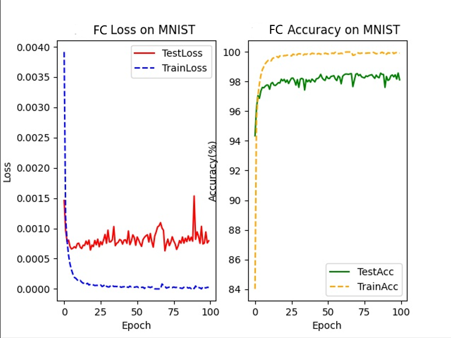

# Classification on MNIST & CIFAR-10 Dataset

The code will automatically download MNIST and CIFAR-10 datasets

Training parameters
| Parameters                | values  |
| ------------------------ | ------ |
| `-b`,`--batch_size`      | `128`   |
| `--epochs`               | `100`   |
| `--lr`                   | `0.001`  |
| `--opt`                  | `SGD`  |
| `--momentum`             | `0.9`  |
| `--wd`, `--weight-decay` | `0` |
| `--device`               | `cpu` |


## MNIST Dataset

Image size: 28 x 28.

Epoch: 100

Batch size: 128

Optimizer: Adam.

Rank: 10.

| Networks         | Layers                                                       | Test accuracy | Learning rate | remark |
| ---------------- | ------------------------------------------------------------ | ------------- | ------------- | -------------- |
| FC-4L            | [784, 784, 784, 784, 10]                                     | 98.64%        | 0.001         | -         |
| FC-8L            | [784, 784, 784, 784, 784, 784, 784, 784, 10]                 | 98.51%        | 0.001         | -         |
| FC-4L (low-rank) | [784, 10, 784, 10, 784, 10, 784, 10]                         | 96.33%        | 0.001         | -  |
| FC-8L (low-rank) | [784, 10, 784, 10, 784, 10, 784, 10, 784, 10, 784, 10, 784, 10, 784, 10] | 97.88%        | 0.001         | -  |
| Spectral-FC-8L-subnets-28 | 28 subnetworks: <br>[28, 28, 28, 28, 28, 28, 28, 28, 10] for each subnetwork. | 94.70% | 0.001 | random |
| Spectral-FC-8L-subnets-4 |  98.17%  | 0.001 with lr scheduler | 98.72% for sub0 |
| Spectral-FC-8L-subnets-4(downsample)* | 4 subnetworks: <br>[196, 196, 196, 196, 196, 196, 196, 196, 10] for each subnetwork. | 98.39%  | 0.001 | 98.53% for sub0 |
| Spectral-FC-8L-subnets-16(downsample) | 16 subnetworks: <br>[49, 49, 49, 49, 49, 49, 49, 49, 10] for each subnetwork. | 97.84% | 0.001 | - |
| Spectral-FC-8L-subnets-28(downsample) | 28 subnetworks: <br>[28, 28, 28, 28, 28, 28, 28, 28, 10] for each subnetwork. | 96.93% | 0.001 | - |
| Spectral-FC-8L-subnets-4 |  98.17%  | 0.001 with lr scheduler | 98.72% for sub0 |
| Spectral-FC-8L-subnets-4 |  98.67%  | 0.001 with lr scheduler | 98.75% for sub0 |



```shell
command :

python train.py --opt adam --model-name FC4Net
python train.py --opt adam --model-name FC8Net
python train.py --opt adam --model-name FC4Net --decom
python train.py --opt adam --model-name FC8Net --decom
python train.py --opt adam --model-name FC8Net --trans dct --l_idx 0 --r_idx 28
python train.py --opt adam --model-name FC8Net --trans dct --l_idx 0 --r_idx 4  --split downsample
python train.py --model-name FC8Net --scheduler steplr --b 256 --lr 0.001 --trans dct --l_idx 0 --r_idx 4 --split downsample --opt adam
python train.py --opt adam --model-name FC8Net --trans dct --l_idx 0 --r_idx 16  --split downsample
python train.py --opt adam --model-name FC8Net --trans dct --l_idx 0 --r_idx 28  --split downsample


```

## CIFAR 10 Dataset

Image size: 32 x 32 x 3.

Epoch: 300.

Batch size: 128.

| Network     | Layers                                                       | Test accuracy | Learning rate | opt |
| ----------- | ------------------------------------------------------------ | ------------- | ------------- | -------------- |
| CNN-8-layer | [(Conv, BatchNorm(BN), ReLU), (Conv, ReLU, BN, MaxPool), (Conv, BN, ReLU), (Conv, BN, ReLU, MaxPool, Dropout), (Conv, BN, ReLU), (Conv, BN, ReLU), (Conv, BN, ReLU, MaxPool), (Dropout, Linear)] | 92.38%        | 0.01          | SGD         |
| CNN-8-layer | [(Conv, BatchNorm(BN), ReLU), (Conv, ReLU, BN, MaxPool), (Conv, BN, ReLU), (Conv, BN, ReLU, MaxPool, Dropout), (Conv, BN, ReLU), (Conv, BN, ReLU), (Conv, BN, ReLU, MaxPool), (Dropout, Linear)] | 90.91%        | 0.001          | SGD         |
| CNN-8-layer | [(Conv, BatchNorm(BN), ReLU), (Conv, ReLU, BN, MaxPool), (Conv, BN, ReLU), (Conv, BN, ReLU, MaxPool, Dropout), (Conv, BN, ReLU), (Conv, BN, ReLU), (Conv, BN, ReLU, MaxPool), (Dropout, Linear)] | 92.42% | 0.001          | adam        |
```shell
command :

python train.py --dataset cifar10 --model-name CNN8CIFAR10 --epochs 300 --lr 0.01
python train.py --dataset cifar10 --model-name CNN8CIFAR10 --epochs 300
python train.py --dataset cifar10 --model-name CNN8CIFAR10 --epochs 300 --opt adam
```

Image size : training 160 x 160; validating 128 x 128.

Epoch: 100.

Batch size: 512.

Optimizer: SGD with momentum = 0.9

lr: 0.003, multiply by 0.1 every 30 epochs

mixup: 0.1

pretrained on ImageNet-21K

| trick index | trick name | setting |
| --- | --- | --- |
| 1 | Random Erasing | 0.1 |
| 2 | Auto Augment | CIFAR10 |
| 3 | label smoothing | 0.05 |
| 4 | TrivialAugment | - |

| Network     | Test accuracy | base_lr | opt | tricks |
| ----------- | ------------- | -------------- | -------------- | --- |
| resnet-152x4| 99.03% | 0.003 | SGD | - |
| resnet-152x4| 99.07% | 0.003 | SGD | 1 |
| resnet-152x4| 99.05% | 0.003 | SGD | 2 |
| resnet-152x4| 99.21% | 0.003 | SGD | 3 |
| resnet-152x4| 99.18% | 0.003 | SGD | 4 |
| resnet-152x4| 99.04% | 0.003 | SGD | 1,2,3 |

```shell
command :

1. cd ./reference_code/bit
2. CUDA_VISIBLE_DEVICES=1,2,3,4 python -m train --dataset cifar10 --model BiT-M-R152x4 --name cifar10_`date +%F_%H%M%S` --logdir ./bit_logs --batch_split 4
```

| Network     | Layers                                                       | Test accuracy | Learning rate | opt |
| ----------- | ------------------------------------------------------------ | ------------- | ------------- | -------------- |
| Spectral-CNN-9-layer-subnets-2 | 2 subnetworks: <br> [(Conv, BatchNorm(BN), ReLU), (Conv, ReLU, BN, MaxPool), (Conv, BN, ReLU), (Conv, BN, ReLU, MaxPool, Dropout), (Conv, BN, ReLU), (Conv, BN, ReLU), (Conv, BN, ReLU), (Conv, BN, ReLU, MaxPool), (Dropout, Linear)] for each subnetwork. | 91.38% | 0.001 | adam |
| Spectral-CNN-9-layer-subnets-4 | 4 subnetworks: <br> [(Conv, BatchNorm(BN), ReLU), (Conv, ReLU, BN, MaxPool), (Conv, BN, ReLU), (Conv, BN, ReLU, MaxPool, Dropout), (Conv, BN, ReLU), (Conv, BN, ReLU), (Conv, BN, ReLU), (Conv, BN, ReLU, MaxPool), (Dropout, Linear)] for each subnetwork. | 89.54% | 0.001 | adam |
| Spectral-CNN-9-layer-subnets-4 | 4 subnetworks: <br> [(Conv, BatchNorm(BN), ReLU), (Conv, ReLU, BN, MaxPool), (Conv, ReLU, BN), (Conv, ReLU, BN, MaxPool, Dropout), (Conv, ReLU, BN), (Conv, ReLU, BN), (Conv, ReLU, BN), (Conv, ReLU, BN, MaxPool), (Dropout, Linear)] for each subnetwork. | 91.68% | 0.001 | adam with steplr scheduler |
| Spectral-CNN-9-layer-subnets-4 | 4 subnetworks: <br> [(Conv, BatchNorm(BN), ReLU), (Conv, ReLU, BN, MaxPool), (Conv, ReLU, BN), (Conv, ReLU, BN, MaxPool, Dropout), (Conv, ReLU, BN), (Conv, ReLU, BN), (Conv, ReLU, BN), (Conv, ReLU, BN, MaxPool), (Dropout, Linear)] for each subnetwork. | 89.42% | 0.001 | SGD |
| Spectral-CNN-9-layer-subnets-16 | 16 subnetworks: <br> [(Conv, BatchNorm(BN), ReLU), (Conv, ReLU, BN, MaxPool), (Conv, BN, ReLU), (Conv, BN, ReLU, MaxPool, Dropout), (Conv, BN, ReLU), (Conv, BN, ReLU), (Conv, BN, ReLU), (Conv, BN, ReLU, MaxPool), (Dropout, Linear)] for each subnetwork. | 80.27% | 0.001 | adam |
| Spectral-CNN-8-layer-subnets-2 | 2 subnetworks: <br> [(Conv, BatchNorm(BN), ReLU), (Conv, ReLU, BN, MaxPool), (Conv, BN, ReLU), (Conv, BN, ReLU, MaxPool, Dropout), (Conv, BN, ReLU), (Conv, BN, ReLU), (Conv, BN, ReLU, MaxPool), (Dropout, Linear)] for each subnetwork. | 90.61 % | 0.001 | adam |
| Spectral-CNN-8-layer-subnets-4 | 4 subnetworks: <br> [(Conv, BatchNorm(BN), ReLU), (Conv, ReLU, BN, MaxPool), (Conv, BN, ReLU), (Conv, BN, ReLU, MaxPool, Dropout), (Conv, BN, ReLU), (Conv, BN, ReLU), (Conv, BN, ReLU, MaxPool), (Dropout, Linear)] for each subnetwork. | 89.39 % | 0.001 | adam |
| Spectral-CNN-8-layer-subnets-4 | 4 subnetworks: <br> [(Conv, BatchNorm(BN), ReLU), (Conv, ReLU, BN, MaxPool), (Conv, BN, ReLU), (Conv, BN, ReLU, MaxPool, Dropout), (Conv, BN, ReLU), (Conv, BN, ReLU), (Conv, BN, ReLU, MaxPool), (Dropout, Linear)] for each subnetwork. | 89.54 % | 0.001 | adamw with 0.01 wd |
| Spectral-CNN-8-layer-subnets-16 | 16 subnetworks: <br> [(Conv, BatchNorm(BN), ReLU), (Conv, ReLU, BN, MaxPool), (Conv, BN, ReLU), (Conv, BN, ReLU, MaxPool, Dropout), (Conv, BN, ReLU), (Conv, BN, ReLU), (Conv, BN, ReLU, MaxPool), (Dropout, Linear)] for each subnetwork. | 80.18% | 0.001 | adam |
| Spectral-CNN-10-layer-subnets-4<br>(pretrained on ImageNet for 5 epochs) | 4 subnetworks: <br> [(Conv, BatchNorm(BN), ReLU), (Conv, ReLU, BN, MaxPool), (Conv, BN, ReLU), (Conv, BN, ReLU, MaxPool, Dropout), (Conv, BN, ReLU), (Conv, BN, ReLU), (Conv, BN, ReLU), (Conv, BN, ReLU, MaxPool, Dropout), (Conv, BN, ReLU, MaxPool), (Dropout, Linear)] for each subnetwork. | 93.98% | 0.001 | adam |
```shell
command :

python train.py --dataset cifar10 --model-name CNN9CIFAR10 --epochs 300 --opt adam --trans dct --l_idx 0 --r_idx 2 --split downsample
python train.py --dataset cifar10 --model-name CNN9CIFAR10 --epochs 300 --opt adam --trans dct --l_idx 0 --r_idx 4 --split downsample
python train.py --dataset cifar10 --model-name CNN9CIFAR10 --epochs 300 --opt adam --scheduler steplr --lr-step-size 30 --lr-gamma 0.1 --trans dct --l_idx 0 --r_idx 4 --split downsample
python train.py --dataset cifar10 --model-name CNN9CIFAR10 --epochs 300 --trans dct --l_idx 0 --r_idx 4 --split downsample
python train.py --dataset cifar10 --model-name CNN9CIFAR10 --epochs 300 --opt adam --trans dct --l_idx 0 --r_idx 16 --split downsample
python train.py --dataset cifar10 --model-name CNN8CIFAR10 --epochs 300 --opt adam --trans dct --l_idx 0 --r_idx 2 --split downsample
python train.py --dataset cifar10 --model-name CNN8CIFAR10 --epochs 300 --opt adam --trans dct --l_idx 0 --r_idx 4 --split downsample
python train.py --dataset cifar10 --model-name CNN8CIFAR10 --epochs 300 --opt adamw --trans dct --l_idx 0 --r_idx 4 --split downsample
python train.py --dataset cifar10 --model-name CNN8CIFAR10 --epochs 300 --opt adam --trans dct --l_idx 0 --r_idx 16 --split downsample
python train.py --dataset cifar10 --model-name CNN10CIFAR10 --epochs 300 --opt adam --trans dct --l_idx 0 --r_idx 4 --split downsample --pretrain ./CNN8CIFAR10.pth
```
| Network     | Layers                                                       | Test accuracy | Learning rate | opt |
| ----------- | ------------------------------------------------------------ | ------------- | ------------- | -------------- |
| Spectral-resnet34-subnets-4<br>(pretrained on ImageNet) | 4 subnetworks: <br> [spectral resnet34 with 10 num_classes] for each subnetwork. | 95.66% | 0.001 | adam |
| Spectral-resnet50-subnets-4<br>(pretrained on ImageNet) | 4 subnetworks: <br> [spectral resnet50 with 10 num_classes] for each subnetwork. | 98.06% | 0.2 with lr scheduler | SGD |
| Spectral-resnext101_64x4d-subnets-4<br>(pretrained on ImageNet) | 4 subnetworks: <br> [spectral resnext101_64x4d with 10 num_classes] for each subnetwork. | 98.23% | 0.2 with lr scheduler | SGD |
```shell
cd ./reference_code
```
training:

```shell
command :

python train.py --model resnet34 --batch-size 512 --lr 0.2 --lr-scheduler cosineannealinglr --lr-warmup-epochs 5 --lr-warmup-method linear \
--auto-augment ta_wide --epochs 600 --random-erase 0.1 --weight-decay 0.0001 --norm-weight-decay 0.0 --mixup-alpha 0.2 --cutmix-alpha 1.0 --idx i --output-dir . \
--train-crop-size 176 --val-resize-size 232 --ra-sampler --ra-reps 4 --label-smoothing 0.05

python train.py --model resnet50 --batch-size 512 --lr 0.2 --lr-scheduler cosineannealinglr --lr-warmup-epochs 5 --lr-warmup-method linear \
--auto-augment ta_wide --epochs 600 --random-erase 0.1 --weight-decay 0.0001 --norm-weight-decay 0.0 --mixup-alpha 0.2 --cutmix-alpha 1.0 --idx i --output-dir . \
--train-crop-size 176 --val-resize-size 232 --ra-sampler --ra-reps 4 --label-smoothing 0.05

python train.py --model resnext101_64x4d --batch-size 512 --lr 0.2 --lr-scheduler cosineannealinglr --lr-warmup-epochs 5 --lr-warmup-method linear \
--auto-augment ta_wide --epochs 600 --random-erase 0.1 --weight-decay 0.0001 --norm-weight-decay 0.0 --mixup-alpha 0.2 --cutmix-alpha 1.0 --idx i --output-dir . \
--train-crop-size 176 --val-resize-size 232 --ra-sampler --ra-reps 4 --label-smoothing 0.05

// one times command gets one subnetwork, --idx i to gets i-th subnetwork
```

ensemble:
```shell
command :

python ensemble.py --model-name resnet34 --l_idx 0 --r_idx 4 --checkpoint-path spectral_resnet34_subx.pth
python ensemble.py --model-name resnet50 --l_idx 0 --r_idx 4 --checkpoint-path spectral_resnet50_subx.pth
python ensemble.py --model-name resnext101_64x4d --l_idx 0 --r_idx 4 --checkpoint-path spectral_resnext101_64x4d_subx.pth
```
| Network     | Layers                                                       | Test accuracy | Learning rate | opt |
| ----------- | ------------------------------------------------------------ | ------------- | ------------- | -------------- |
| Spectral-CNN-9-layer-subnets-4+4<br>(4 dct + 4 fft) | 8 subnetworks: <br> [(Conv, BatchNorm(BN), ReLU), (Conv, ReLU, BN, MaxPool), (Conv, ReLU, BN), (Conv, ReLU, BN, MaxPool, Dropout), (Conv, ReLU, BN), (Conv, ReLU, BN), (Conv, ReLU, BN), (Conv, ReLU, BN, MaxPool), (Dropout, Linear)] for each subnetwork. | 90.36%  | 0.001 | adam |
| Spectral-resnet50-subnets-4+4<br>(4 dct + 4 fft, pretrain on ImageNet) | 8 subnetworks: <br> [spectral resnet50 with 10 num_classes] for each subnetwork. | 98.20% | 0.2 with lr scheduler | SGD |
```shell
command :

1. python train.py --dataset cifar10 --model-name CNN9CIFAR10 --epochs 300 --trans dct --l_idx 0 --r_idx 4 --split downsample
2. python train.py --dataset cifar10 --model-name CNN9CIFAR10 --epochs 300 --trans fft --l_idx 0 --r_idx 4 --split downsample
3. python ensemble.py --model-name CNN9CIFAR10 --l_idx 0 --r_idx 8 --dct-nets 4 --checkpoint-path spectral_CNN9CIFAR10_subx.pth

1. python train.py --dataset cifar10 --model-name resnet50 --epochs 300 --trans dct --l_idx 0 --r_idx 4 --split downsample
2. python train.py --dataset cifar10 --model-name resnet50 --epochs 300 --trans fft --l_idx 0 --r_idx 4 --split downsample
3. python ensemble.py --model-name CNN9CIFAR10 --l_idx 0 --r_idx 8 --dct-nets 4 --checkpoint-path spectral_resnet50_subx.pth

```

### Spectral-resnet152x4 :

| sub-network   | sub0 | sub1 | sub2 | sub3 |
| -----------  | ------------- | ------------- | -------------- | --------|
| acc | 99.00% | 97.47% | 89.18% | 97.45% |
| acc(lab) | 99.18% | 98.12% | 91.84% | 98.21% |

| Ensemble-network | sub0,1 | sub0~3 | sub0,1,3 |
| -----------  | ------------- | ------------- | --- |
| acc (p = 0.3)| 98.96% | 98.07% | 98.87% |
|acc (p = 0.4) |-|-|98.96%|
|acc (p = 0.5) |-|-|99.00%|
|acc (p = 0.6) |99.01%|99.02%|99.04% |
|acc (p = 0.7) |-|-|99.01%|
|acc (p = 0.9) |-|-|99.20% for lab|

## ImageNet Dataset
| Network     | Test accuracy | Model size | Training time|
| ----------- |  ------------- | --- | --- |
|AlexNet|63.44%*|224 MB| 40.8h |
|spectral-AlexNet|63.43%| 37.73 MB | 20.2h |
|VGG-16|73.21%|527.79 MB| 81.2h |
|Spectral-VGG-16|72.82 %| 207.82 MB | 44.14h |
|ResNet-34|76.1%|83.15 MB| 43.66h |
|spectral-ResNet34-sub4|78.29% | 83.15 MB | 76.02h |
|spectral-ResNet34-sub16| 71.13 %| 83.15 MBx16 | 20.02 h |

### spectral-ResNet-sub4:


### Spectral-resnet50 :

| sub-network   | sub0 | sub1 | sub2 | sub3 |
| -----------  | ------------- | ------------- | -------------- | --------|
| acc | 77.53% | 73.42% | 61.21% | 73.44% |

| Ensemble-network | sub0,1,3 |
| -----------  | --- |
| acc (p = 0.3)| 77.68% |
|acc (p = 0.6) | 77.83% |
|acc (p = 0.8) | 77.84% |
|acc (p = 0.9) | 77.76% |

### Spectral-resnet34(600 epochs) :

| sub-network   | sub0 | sub1 | sub2 | sub3 |
| -----------  | ------------- | ------------- | -------------- | --------|
| acc | 76.31% | 74.39% | 68.79% | 74.82% |
| Ensemble-network | sub0,1,3 |
| -----------  | --- |
| acc (p = 0.3)| 78.29 % |


## ImageNet-21K result
| Network     | Test accuracy | Model size | Training time|
| ----------- |  ------------- | --- | --- |
|ResNet-34| 40.45% | 122.35 MB | >246 h  |
|spectral-ResNet-34| 30.40% | 122.35 MB | 90 h |
|spectral-ResNet-34| 32.45% | 122.35 MB | - |

| sub-network   | sub0 | sub1 | sub2 | sub3 |
| -----------  | ------------- | ------------- | -------------- | --------|
| acc | 28.74% | 21.84% | 11.68% | 10.45% |
| acc | 2.38% | 25.56% | 25.17% | 28.71% |


```shell
command :

CUDA_VISIBLE_DEVICES=4,7 nohup python -u -m train_for_spectral --name cifar10_`date +%F_%H%M%S` --model BiT-M-R152x4 --logdir ./bit_logs --dataset cifar10 --datadir /xfs/home/tensor_zy/zhangjie/datasets --workers 16 --batch_split 4 --idx 1

python ensemble.py --r_idx 4 --checkpoint_path /colab_space/yanglet/model_weight/spectral-resnet152x4-subx.pth.tar

```