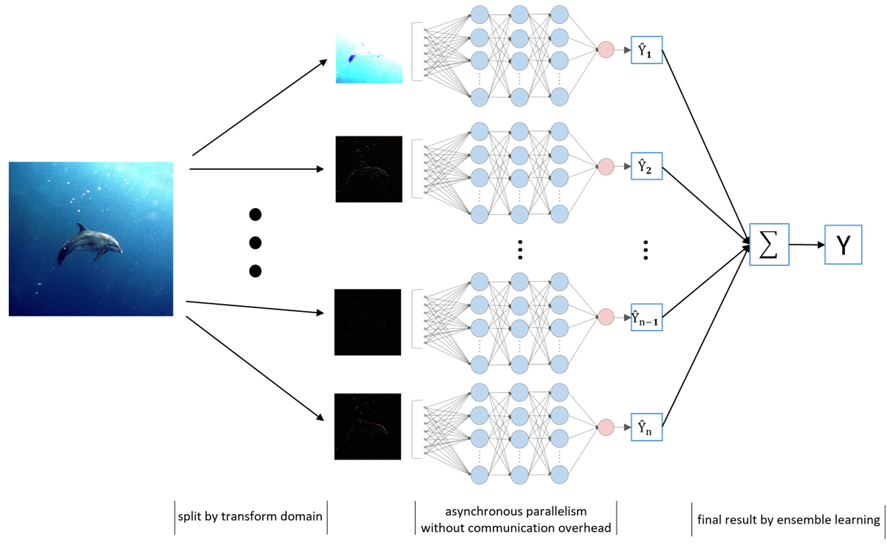

# Spectral Tensor Layer for Communication-free Distributed Deep Learning
# Highly Parallel Deep Ensemble Learning on GPUs

## Data-Split
### Grayscale Image

### RGB Image

[MNIST & CIFAR10](./MNIST%20&%20CIFAR10)

[ImageNet-1K & ImageNet-21K](./ImageNet-1K%20&%20ImageNet-21K)
