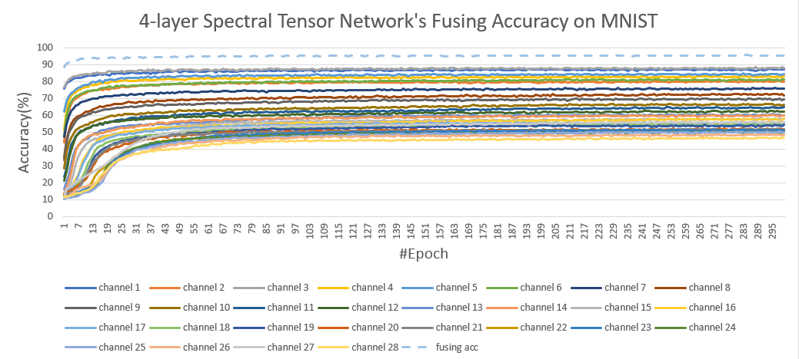
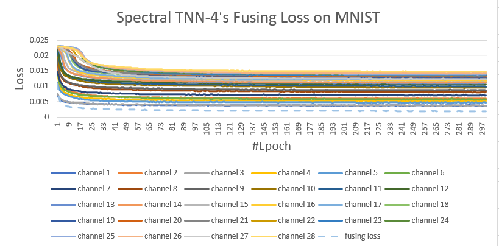
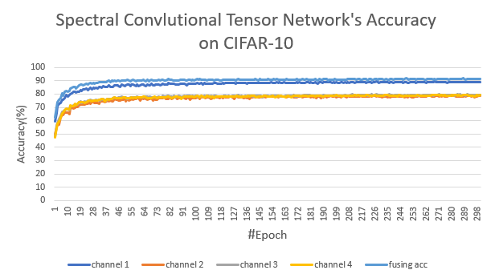
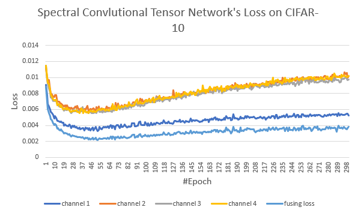

## MNIST Dataset

Image size: 28 x 28.  

#Epoch: 100 for FC; 300 for both tNN and spectral tensor network.  

Batch size: 64 for FC; 100 for both tNN and spectral tensor network.

Optimizer: Adam for 8-layer spectral tensor network; SGD with momentum=0.9 for others.

Rank: 16.

|Networks|File|Layers|Test accuracy|Learning rate|Initialization|
|-|-|-|-|-|-|
|FC-4-layer |fc_4_mnist.py|[784, 784, 784, 784, 10]|98.63%|0.01|random
|FC-8-layer |fc_8_mnist.py|[784, 784, 784, 784, 784, 784, 784, 784, 10]|98.66%|0.01|random
|FC-4-layer (low-rank)| fc_4_lowrank_mnist.py|[784, 16, 784, 16, 784, 16, 784, 10]| 97.80%|0.05|xavier normal
|FC-8-layer (low-rank)| fc_8_lowrank_mnist.py|[784, 16, 784, 16, 784, 16, 784, 16, 784, 16, 784, 16, 784, 16, 784, 10]| 97.86%|0.001|xavier normal
|tNN-4-layer |tnn_4_mnist.py| [(28, 28, 28), (28, 28, 28), (28, 28, 28), (28, 28, 28), (28, 10, 28)]|97.84%;  <98.0% in [1].|0.1|random
|tNN-8-layer |tnn_8_mnist.py| [(28, 28, 28), (28, 28, 28), (28, 28, 28), (28, 28, 28), (28, 28, 28), (28, 28, 28), (28, 28, 28), (28, 28, 28), (28, 10, 28)]|97.81%;  ~= 98.0% in [1].|0.01;  0.1 in [1].|random
|Spectral-tensor-4-layer| spectral_tensor_4_mnist.py| 28 subnetworks:  [28, 28, 28, 28, 10] for each subnetwork. | 95.74% | 0.001| random
|Spectral-tensor-8-layer| spectral_tensor_8_mnist.py| 28 subnetworks:  [28, 28, 28, 28, 28, 28, 28, 28, 10] for each subnetwork. | 95.92% |0.001|random

**Our spectral tensor networks**: 

1). Preprocess training dataset: perform DCT on the data along the width-dimension (size 28), and split the training dataset into 28 subsets corresponding to 28 spectrals (for each image, each spectral has a 28 x 1 vector); 

2). Train 28 subnetworks (4-layer and 8-layer FC, respectively) with training dataset: the 28 spectral data as **input** and the corresponding labels as **output**;

3). Obtain the trained 28 subnetworks and corresponding loss values; 

4). In the testing phase, use the loss values to set weights as 1/loss; get the 28 spectrals of a new image and input them into the 28 trained subnetwork; fuse the 28 outputs by weighted sum to obtain the predicted label.

- - -

Image size: 28 x 28.  

#Epoch: 300.  

Batch size: 100.

Optimizer: SGD with momentum = 0.9.

|Networks|File|Layers |Test accuracy|Learning rate|Initialization
|-|-|-|-|-|-|
|CNN-4-layer|cnn_4_mnist.py|[(Conv, ReLU, MaxPool), (Conv, ReLU, Dropout, MaxPool), (Conv, ReLU, MaxPool), (Dropout, Linear)] | 99.44% | 0.01 | random 
|CNN-4-layer|cnn_8_mnist.py|[(Conv, ReLU), (Conv, ReLU), (Conv, ReLU), (Conv, ReLU, Dropout, MaxPool), (Conv, ReLU), (Conv, ReLU), (Conv, ReLU, MaxPool), (Dropout, Linear)] | 99.47% |  0.01 | random 

## CIFAR 10 Dataset
Image size: 32 x 32 x 3.

#Epoch: 300.  

Batch size: 128.

Rank: 16.

Optimizer: SGD with momentum = 0.9.

|Network|File|Layers|Test accuracy|Learning rate|Initialization
|-|-|-|-|-|-|
|FC-4-layer|fc_4_cifar10.py|[3072, 3072, 3072, 3072, 10]|59.40%|0.01|random
|FC-8-layer|fc_8_cifar10.py|[3072, 3072, 3072, 3072, 3072, 3072, 3072, 3072, 10]|59.19%|0.01|random
|FC-4-layer (low-rank)|fc_4_lowrank_cifar10.py|[3072, 16, 3072, 16, 3072, 16, 3072, 10]|51.25%(need to be tuned)|0.01|xavier normal
|FC-8-layer (low-rank)|fc_8_lowrank_cifar10.py|[3072, 16, 3072, 16, 3072, 16, 3072, 16, 3072, 16, 3072, 16, 3072, 16, 3072, 10]|48.33%(need to be tuned)|0.0001|xavier normal

- - - 

Image size: 32 x 32 x 3.

#Epoch: 300.  

Batch size: 128.

Optimizer: SGD with momentum = 0.9.

|Network|File|Layers|Test accuracy|Learning rate|Initialization
|-|-|-|-|-|-|
|CNN-4-layer|cnn_4_cifar10.py|[(Conv, BatchNorm(BN), ReLU), (Conv, ReLU, BN, MaxPool), (Conv, BN, ReLU, MaxPool, Dropout), (Dropout, Linear)] | 87.04% | 0.05 | random
|CNN-8-layer|cnn_8_cifar10.py|[(Conv, BatchNorm(BN), ReLU), (Conv, ReLU, BN, MaxPool), (Conv, BN, ReLU), (Conv, BN, ReLU, MaxPool, Dropout), (Conv, BN, ReLU), (Conv, BN, ReLU), (Conv, BN, ReLU, MaxPool), (Dropout, Linear)] | 92.07% | 0.01 | random 
|Spectral-convolutional-tensor-8-layer| spectral_conv_tensor_8_cifar10.py|3 subnetworks:   [(Conv, BatchNorm(BN), ReLU), (Conv, ReLU, BN, MaxPool), (Conv, BN, ReLU), (Conv, BN, ReLU, MaxPool, Dropout), (Conv, BN, ReLU), (Conv, BN, ReLU), (Conv, BN, ReLU, MaxPool), (Dropout, Linear)] for each subnetwork. | 91.47% | 0.001 | random 

**Our spectral convolutional tensor networks**: 

1). Preprocess training dataset: perform DCT on the data along the channel-dimension (size 3), and split the training dataset into 3 subsets corresponding to 3 spectrals (for each image, each spectral has a 32 x 32 matrix);

2). Train 3 subnetworks (8-layer CNN) with training dataset: the 3 spectral data as **input** and the corresponding labels as **output**;

3). Obtain the trained 3 subnetworks and corresponding loss values;

4). In the testing phase, use the loss values to set weights as 1/loss; get the 3 spectrals of a new image and input them into the 3 trained subnetwork; fuse the 3 outputs by weighted sum to obtain the predicted label.

- - -

Image size: 32 x 32 x 3.

#Epoch: 300.  

Batch size: 128.

Optimizer: SGD with momentum = 0.9.

|Network|File|Layers|Test accuracy|Learning rate|Initialization
|-|-|-|-|-|-|
|Spectral-convolutional-tensor-8-layer| 4c_spectral_conv_tensor_8_cifar10.py|4 subnetworks:   [(Conv, BatchNorm(BN), ReLU), (Conv, ReLU, BN, MaxPool), (Conv, BN, ReLU), (Conv, BN, ReLU, MaxPool, Dropout), (Conv, BN, ReLU), (Conv, BN, ReLU), (Conv, BN, ReLU, MaxPool), (Dropout, Linear)] for each subnetwork. | 91.93% | 0.001 | random 

**Our spectral convolutional tensor networks**

1). Preprocess training dataset:

* Add a new channel _m_ to CIFAR images: [_r_, _g_, _b_] -> [_r_, _g_, _b_, _m_], where _m_ is the average of _r_, _g_, _b_ channels; 

* Reorganize the images by rearranging the 4 channels in 4 ways: [_r_, _g_, _b_, _m_], [_r_, _g_, _m_, _b_], [_r_, _m_, _g_, _b_], [_m_, _r_, _g_, _b_];

* Perform DCT on the 4 rearranged data along the channel-dimension (size 4). For each image the transformed data is a 32 x 32 x 4 tensor with 4 spectrals, where each spectral has a 32 x 32 matrix.

* Split the training dataset into 4 subsets: stack the 4 first spectrals of the 4 transformed data to obtain the first subset; stack the 4 second spectrals of the 4 transformed data to obtain the second subset; and so on.

2). Train 4 subnetworks (8-layer CNN) with training dataset: the 4 data subset as **input** and the corresponding labels as **output**;

3). Obtain the trained 4 subnetworks and corresponding loss values;

4). In the testing phase, use the loss values to set weights as 1/loss; get the 4 processed data of a new image (like in step 1) ) and input them into the 4 trained subnetwork; fuse the 4 outputs by weighted sum to obtain the predicted label.

## Reference

[1] Stable Tensor Neural Networks for Rapid Deep Learning (https://arxiv.org/abs/1811.06569).