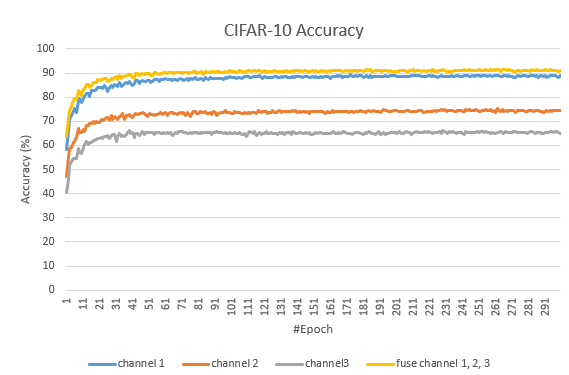
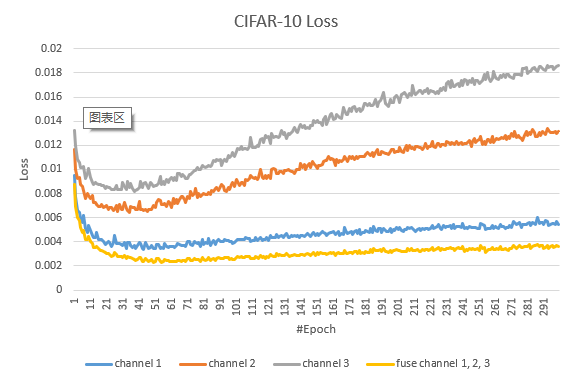

## CIFAR 10 Task
|Description|File name|Network structure|Test accuracy|#Epoch|Learning rate|Batch size|Initialization method|Optimizer
|-|-|-|-|-|-|-|-|-|
|4-layer FC|fcn_4_cifar10.py|[3072, 3072, 3072, 3072, 10]|59.40%|300|0.01|128|random|SGD with 0.9 momentum
|8-layer FC|fcn_8_cifar10.py|[3072, 3072, 3072, 3072, 3072, 3072, 3072, 3072, 10]|59.19%|300|0.01|128|random|SGD with 0.9 momentum
|4-layer FC (decomposed)|de_fcn_4_cifar10.py|[3072, 16, 3072, 16, 3072, 16, 3072, 10]|51.25%(need to be tuned)|300|0.01|128|xavier normal|SGD with 0.9 momentum
|8-layer FC (decomposed)|de_fcn_8_cifar10.py|[3072, 16, 3072, 16, 3072, 16, 3072, 16, 3072, 16, 3072, 16, 3072, 16, 3072, 10]|48.33%(need to be tuned)|300|0.0001|128|xavier normal|SGD with 0.9 momentum
|4-layer CNN|cnn_4_cifar10.py|[(Conv, BatchNorm(BN), ReLU), (Conv, ReLU, BN, MaxPool), (Conv, BN, ReLU, MaxPool, Dropout), (Dropout, Linear)] | 87.04% | 300 | 0.05 | 128 | random | SGD with 0.9 momentum
|8-layer CNN|cnn_8_cifar10.py|[(Conv, BatchNorm(BN), ReLU), (Conv, ReLU, BN, MaxPool), (Conv, BN, ReLU), (Conv, BN, ReLU, MaxPool, Dropout), (Conv, BN, ReLU), (Conv, BN, ReLU), (Conv, BN, ReLU, MaxPool), (Dropout, Linear)] | 92.07% | 300 | 0.01 | 128 | random | SGD with 0.9 momentum
|DCT (discrete cosine transform) for input data, build 3 CNNs for the 3 channels of processed data, respectively.|multi_cnn_8_cifar10.py|[(Conv, BatchNorm(BN), ReLU), (Conv, ReLU, BN, MaxPool), (Conv, BN, ReLU), (Conv, BN, ReLU, MaxPool, Dropout), (Conv, BN, ReLU), (Conv, BN, ReLU), (Conv, BN, ReLU, MaxPool), (Dropout, Linear)] x 3|[channel 1, channel 2, channel 3]  [89.21%, 74.20%, 66.06%]|300|[0.001, 0.001, 0.001]|128|random|SGD with 0.9 momentum
|1. DCT (discrete cosine transform) for input data, build 3 CNNs for the 3 channels of processed data, respectively. 2. Fuse the outputs of the 3 CNNs (for the 3 channels) for prediction.| fuse_cnn_8_cifar10.py|[(Conv, BatchNorm(BN), ReLU), (Conv, ReLU, BN, MaxPool), (Conv, BN, ReLU), (Conv, BN, ReLU, MaxPool, Dropout), (Conv, BN, ReLU), (Conv, BN, ReLU), (Conv, BN, ReLU, MaxPool), (Dropout, Linear)] x 3 | 91.47% | 300 | [0.001, 0.001, 0.001] | 128 | random | SGD with 0.9 momentum

### Experiments on CIFAR 10

## MNIST Task
|Description|File name|Network structure|Test accuracy|#Epoch|Learning rate|Batch size|Initialization metod|Optimizer
|-|-|-|-|-|-|-|-|-|
|4-layer FC|fcn_4_mnist.py|[784, 784, 784, 784, 10]|98.63%|100|0.01|64|random|SGD with 0.9 momentum
|8-layer FC|fcn_8_mnist.py|[784, 784, 784, 784, 784, 784, 784, 784, 10]|98.66%|100|0.01|64|random|SGD with 0.9 momentum
|4-layer FC (decomposed)|de_fcn_4_mnist.py|[784, 16, 784, 16, 784, 16, 784, 10]| 97.80% |100|0.05|64|xavier normal|SGD with 0.9 momentum
|8-layer FC (decomposed)|de_fcn_8_mnist.py|[784, 16, 784, 16, 784, 16, 784, 16, 784, 16, 784, 16, 784, 16, 784, 10]| 97.86% |100|0.001|64|xavier normal|SGD with 0.9 momentum
|4-layer CNN|cnn_4_mnist.py|[(Conv, ReLU, MaxPool), (Conv, ReLU, Dropout, MaxPool), (Conv, ReLU, MaxPool), (Dropout, Linear)] | 99.44% | 100 | 0.01 | 64 | random | SGD with 0.9 momentum
|8-layer CNN|cnn_8_mnist.py|[(Conv, ReLU), (Conv, ReLU), (Conv, ReLU), (Conv, ReLU, Dropout, MaxPool), (Conv, ReLU), (Conv, ReLU), (Conv, ReLU, MaxPool), (Dropout, Linear)] | 99.47% | 100 | 0.01 | 64 | random | SGD with 0.9 momentum
|4-layer tNN |tnn_4_mnist.py| [(28, 28, 28), (28, 28, 28), (28, 28, 28), (28, 28, 28), (28, 10, 28)]|97.84%|300|0.1|100|random|SGD with 0.9 momentum
|4-layer tNN **(in reference)**|-| [(28, 28, 28), (28, 28, 28), (28, 28, 28), (28, 28, 28), (28, 10, 28)]|<98.0%|300|0.1|100|not mentioned|SGD with 0.9 momentum
|8-layer tNN |tnn_8_mnist.py| [(28, 28, 28), (28, 28, 28), (28, 28, 28), (28, 28, 28), (28, 28, 28), (28, 28, 28), (28, 28, 28), (28, 28, 28), (28, 10, 28)]|97.81%|300|0.01|100|random|SGD with 0.9 momentum
|8-layer tNN **(in reference)**|-| [(28, 28, 28), (28, 28, 28), (28, 28, 28), (28, 28, 28), (28, 28, 28), (28, 28, 28), (28, 28, 28), (28, 28, 28), (28, 10, 28)]|~98%|300|0.1|100|not mentioned|SGD with 0.9 momentum

### Experiments on MNIST

